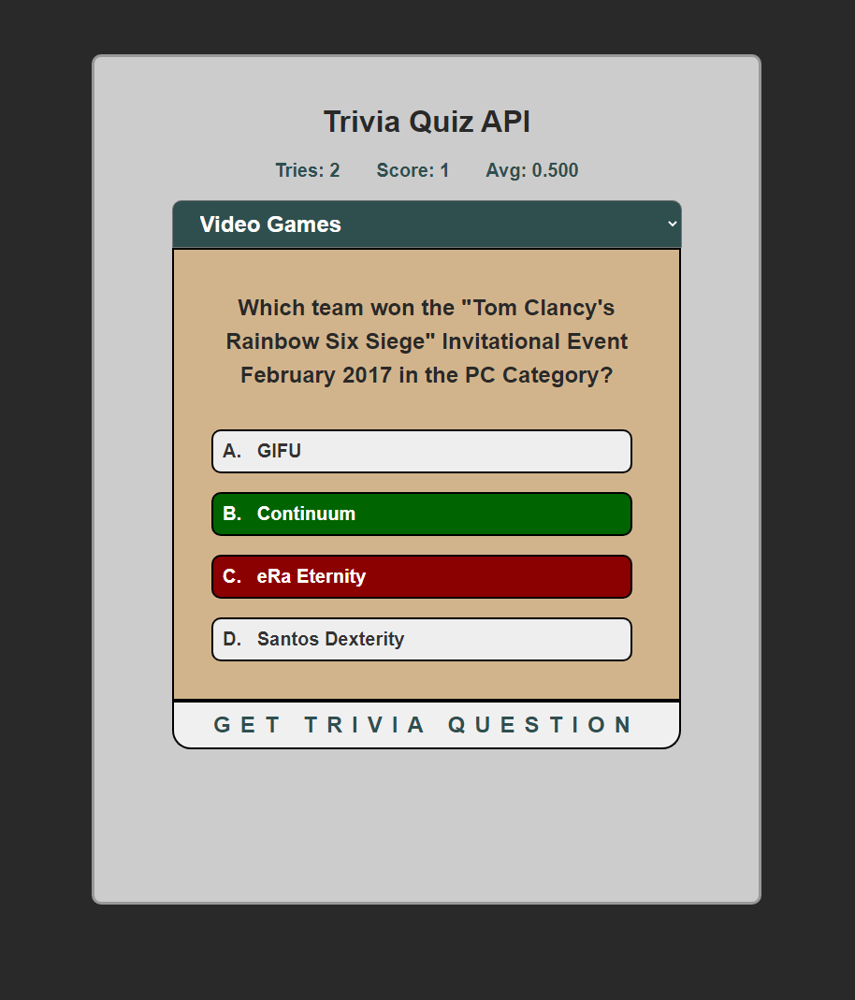

# Trivia Quiz API

## General Info
This is a project that takes the API from openTDB and presents trivia questions from all the multiple-choice trivia questions  
Score is kept tracked based on users input on how many correct and incorrect answers they made.

## Deployment
Go to [https://jchen2190.github.io/triviaAPI/](https://jchen2190.github.io/triviaAPI/)